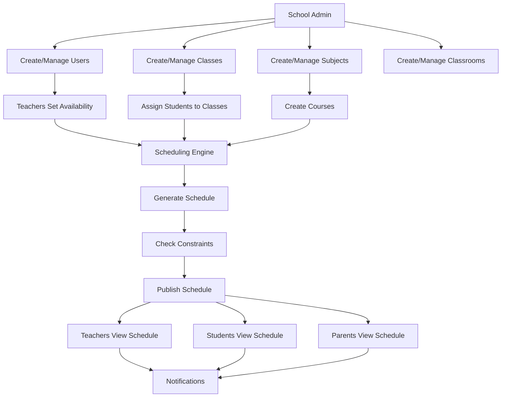

# School Time Scheduler - Data Model Diagram

## Entity Relationship Diagram

```mermaid
erDiagram
    %% Core User Entities
    User {
        int id PK
        string email
        string name
        enum role
        string avatar
        string phone
        boolean isActive
        datetime createdAt
        datetime updatedAt
    }

    Admin {
        int id PK
        int schoolId FK
        array permissions
    }

    Teacher {
        int id PK
        int schoolId FK
        array subjects
        array qualifications
        int experience
        array availability
    }

    Student {
        int id PK
        int schoolId FK
        int classId FK
        int parentId FK
        int grade
        object emergencyContact
    }

    Parent {
        int id PK
        int schoolId FK
        string phone
        object address
        array children
    }

    %% School & Organization
    School {
        int id PK
        string name
        object address
        string phone
        string email
        string principal
        string academicYear
        boolean isActive
        object settings
        datetime createdAt
        datetime updatedAt
    }

    SchoolSettings {
        int id PK
        int schoolId FK
        int periodDuration
        int breakDuration
        int lunchDuration
        string startTime
        string endTime
        int maxPeriodsPerDay
        int maxPeriodsPerWeek
        boolean allowConflicts
        boolean autoSchedule
    }

    Address {
        int id PK
        string street
        string city
        string state
        string zipCode
        string country
    }

    %% Academic Entities
    Class {
        int id PK
        int schoolId FK
        int teacherId FK
        string name
        int grade
        string section
        int capacity
        int currentEnrollment
        string academicYear
        boolean isActive
        array students
        datetime createdAt
        datetime updatedAt
    }

    Subject {
        int id PK
        int schoolId FK
        string name
        string code
        string description
        int credits
        boolean isActive
        array teachers
        datetime createdAt
        datetime updatedAt
    }

    Course {
        int id PK
        int subjectId FK
        int classId FK
        int teacherId FK
        string name
        string academicYear
        int semester
        boolean isActive
        datetime createdAt
        datetime updatedAt
    }

    %% Scheduling Entities
    Period {
        int id PK
        int schoolId FK
        string name
        string startTime
        string endTime
        int duration
        enum type
        int order
        boolean isActive
    }

    Schedule {
        int id PK
        int schoolId FK
        string name
        string academicYear
        boolean isActive
        boolean isPublished
        array scheduleItems
        datetime createdAt
        datetime updatedAt
    }

    ScheduleItem {
        int id PK
        int scheduleId FK
        int periodId FK
        int courseId FK
        int classroomId FK
        int teacherId FK
        int classId FK
        int dayOfWeek
        boolean isActive
        datetime createdAt
        datetime updatedAt
    }

    Classroom {
        int id PK
        int schoolId FK
        string name
        string number
        string building
        int floor
        int capacity
        enum type
        array equipment
        boolean isActive
        datetime createdAt
        datetime updatedAt
    }

    %% Availability & Constraints
    TeacherAvailability {
        int id PK
        int teacherId FK
        int dayOfWeek
        string startTime
        string endTime
        boolean isAvailable
        string reason
        string academicYear
        datetime createdAt
        datetime updatedAt
    }

    Constraint {
        int id PK
        int schoolId FK
        string name
        enum type
        string description
        string rule
        enum priority
        boolean isActive
        datetime createdAt
        datetime updatedAt
    }

    %% Communication & System
    Notification {
        int id PK
        int userId FK
        string title
        string message
        enum type
        boolean isRead
        datetime createdAt
        datetime expiresAt
    }

    EmergencyContact {
        int id PK
        string name
        string relationship
        string phone
        string email
        object address
        boolean isPrimary
    }

    Permission {
        int id PK
        string name
        string description
        string resource
        string action
        boolean isActive
    }

    Role {
        int id PK
        string name
        string description
        array permissions
        boolean isActive
        datetime createdAt
        datetime updatedAt
    }

    %% Relationships
    School ||--o{ User : "has"
    School ||--o{ Class : "has"
    School ||--o{ Subject : "has"
    School ||--o{ Classroom : "has"
    School ||--o{ Schedule : "has"
    School ||--o{ Constraint : "has"
    School ||--|| SchoolSettings : "has"

    User ||--o{ Notification : "receives"
    User ||--o{ TeacherAvailability : "has"

    Class ||--o{ Student : "contains"
    Class ||--o{ Course : "offers"
    Class ||--|| Teacher : "led_by"

    Subject ||--o{ Course : "offered_as"
    Subject }o--o{ Teacher : "taught_by"

    Course ||--o{ ScheduleItem : "scheduled_in"
    Course ||--|| Teacher : "taught_by"
    Course ||--|| Class : "belongs_to"
    Course ||--|| Subject : "based_on"

    Schedule ||--o{ ScheduleItem : "contains"
    ScheduleItem ||--|| Period : "uses"
    ScheduleItem ||--|| Classroom : "held_in"
    ScheduleItem ||--|| Course : "for"
    ScheduleItem ||--|| Teacher : "taught_by"
    ScheduleItem ||--|| Class : "for"

    Parent ||--o{ Student : "has_children"
    Student ||--|| EmergencyContact : "has"

    Role }o--o{ Permission : "has"
    Admin }o--o{ Permission : "has"
```

## Key Relationships Summary

### 1. School-Centric Architecture
- **School** is the central entity that owns all other entities
- All users, classes, subjects, classrooms, and schedules belong to a school
- School settings control scheduling behavior

### 2. User Hierarchy
- **User** base class with role-based extensions (Admin, Teacher, Student, Parent)
- Each user belongs to one school
- Role-based permissions and access control

### 3. Academic Structure
- **Class** contains students and offers courses
- **Subject** defines what can be taught
- **Course** is the actual offering of a subject to a class by a teacher

### 4. Scheduling System
- **Schedule** contains multiple **ScheduleItem**s
- Each **ScheduleItem** links a course to a period, classroom, and teacher
- **TeacherAvailability** controls when teachers can teach
- **Constraint**s define scheduling rules

### 5. Physical Resources
- **Classroom**s are physical spaces where classes are held
- Different classroom types (classroom, lab, gym, etc.)
- Capacity and equipment tracking

### 6. Communication
- **Notification**s for users
- **EmergencyContact**s for students
- Parent-child relationships

## Data Flow



## Mock Data Structure

The system will use mock data following this structure:

```typescript
interface MockData {
  schools: School[];
  users: User[];
  classes: Class[];
  subjects: Subject[];
  courses: Course[];
  periods: Period[];
  schedules: Schedule[];
  scheduleItems: ScheduleItem[];
  classrooms: Classroom[];
  teacherAvailabilities: TeacherAvailability[];
  constraints: Constraint[];
  notifications: Notification[];
  permissions: Permission[];
  roles: Role[];
}
```

This comprehensive data model supports:
- ✅ Multi-role user management
- ✅ Complex scheduling with constraints
- ✅ Resource management (classrooms, teachers)
- ✅ Academic structure (classes, subjects, courses)
- ✅ Communication and notifications
- ✅ Scalable architecture for future features 